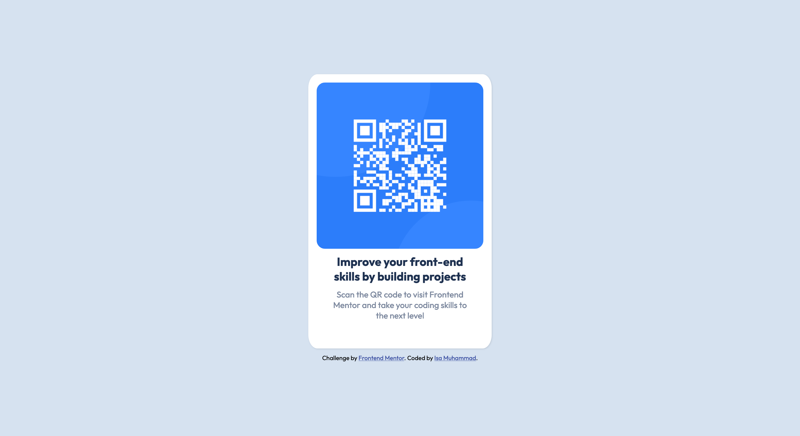

# Frontend Mentor - QR code component solution

This is a solution to the [QR code component challenge on Frontend Mentor](https://www.frontendmentor.io/challenges/qr-code-component-iux_sIO_H). Frontend Mentor challenges help you improve your coding skills by building realistic projects.

## Table of contents

- [Overview](#overview)
  - [Screenshot](#screenshot)
  - [Links](#links)
- [My process](#my-process)

  - [Built with](#built-with)
  - [What I learned](#what-i-learned)

- [Author](#author)

## Overview

Frontend mentor challenge - QR code component

### Screenshot

### Links

- Solution URL: (https://github.com/Isa-Muhammad/qr-code-component)
- Live Site URL: [Add live site URL here](https://your-live-site-url.com)

## My process

My approach with this challenge was mobile-first design. This ensured that the mobile view of the component is just as appealing as the desktop view.

### Built with

- Semantic HTML5 markup
- CSS custom properties
- Flexbox
- Mobile-first workflow

### What I learned

This challenge helped me acheive responsive design using css-flexbox. Additionally, leveraging Semantic HTML not only enhanced the structure of the code but also contributed to the overall accessibility and clarity of the code.

## Author

- Website - [Isa Muhammad](https://isamuhammad.netlify.app/)
- Frontend Mentor - [@Isa-Muhammad](https://www.frontendmentor.io/profile/Isa-Muhammad)
